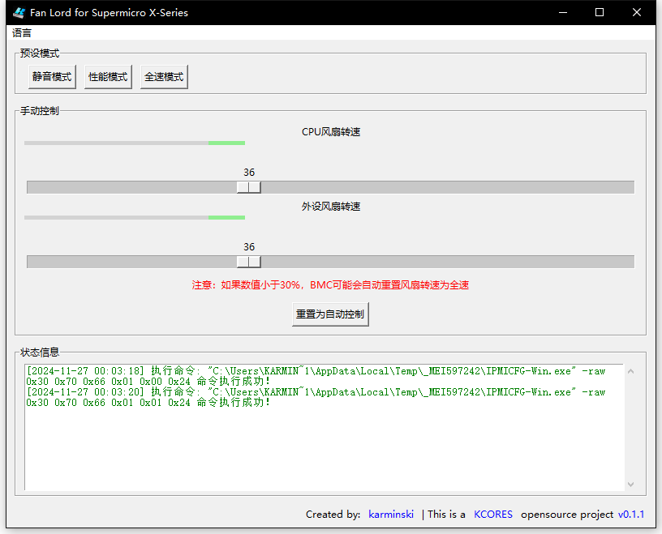

Fan Lord
--------

[README in English](README_en-US.md)



一个用于控制 Supermicro X 系列主板风扇的图形界面工具。

本项目是一个 [KCORES 开源项目](https://github.com/KCORES)。

## 功能特性

- 控制 Supermicro X 系列服务器主板的风扇
- 显示风扇状态

## 目标

- 为所有具有 IPMI 接口的主板提供简单易用的风扇控制图形界面
- 欢迎为本项目做出贡献

## 构建

```bash
make all
```

## 许可证

本项目采用 [KCORES 许可证](LICENSE_en-US) 授权。

项目中依赖的 IPMI 二进制程序和动态链接库来自 Supermicro IPMI Utilities，Supermicro 保有其版权。

## 关于安全性

本项目并没有购买证书用于代码签名, 所以运行时需要手动允许 SmartScreen 放行该项目。

基于安全性的考虑, 建议您尝试自己构建这个项目。

## 作者

- [karminski](https://github.com/karminski)


