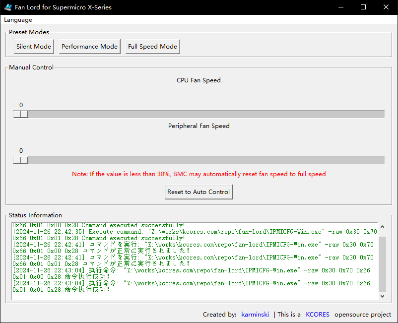

Fan Lord
--------

[README in Chinese](README.md)




A GUI tool for controlling the fans of Supermicro X-Series servers.

This project is a [KCORES opensource project](https://github.com/KCORES).

## Features

- Control the fans of Supermicro X-Series servers.
- Display the status of the fans.

## Goals

- Provide a simple and easy-to-use GUI for controlling the fans of all motherboards which have IPMI interface.
- Welcome to contribute to this project.

## Build

```bash
make all
```

## License

This project is licensed under the [KCORES License](LICENSE_en-US).

The IPMI binary program and dynamic library used in this project are from Supermicro IPMI Utilities, and Supermicro owns the copyright.

## About Security

This project does not have a purchased certificate for code signing, so you need to manually allow SmartScreen to run this project.

For security considerations, it is recommended that you try to build this project yourself.

## Author

- [karminski](https://github.com/karminski)
